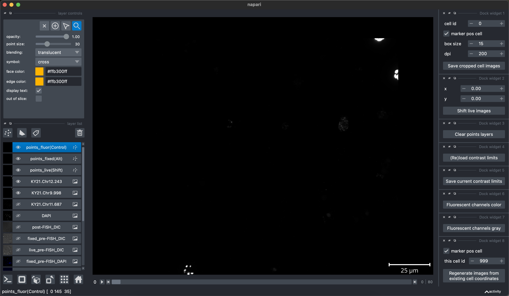

The scripts in this folder were used to analyze images for HCR FISH, specifically to visualize images using [napari](https://napari.org/stable/index.html), then to facilitate quick manual matching of cells between the _pre-FISH live_, _pre-FISH fixed_, and _post-FISH_ fluorescence rounds of imaging. See methods sections "Cell Preparation for HCR FISH with Live Imaging" for a description of the pre-FISH image collection, and "HCR FISH" for a description of the _post-FISH_ imaging and image analysis summary.

Key files in this folder:
- `image_analysis_pipeline.py` runs the image analysis pipeline. This readme describes how to run it, and what file structure it expects for raw image files.
- `napari_image_analysis_env.yml` and `napari_image_analysis_env.txt` contain information on the conda environment used, saved to a text file (by running `conda env export --no-builds > napari_image_analysis_env.yml` and `conda list --explicit > napari_image_analysis_env.txt`). The .txt files is for MacOS only.
- `raw_images/` is a folder which must contain the raw imaging files to successfully run `image_analysis_pipeline.py`. See "[Subfolder structure](#subfolder-structure)" for more detail.
- `HCR_PROBES_MASTER_LIST.xlsx` is an excel spreadsheet containing a conversion between probe IDs used in python scripts (e.g. HP14) and genes labeled (e.g. KY21.Chr11.687). This is needed to run `image_analysis_pipeline.py`.

---

## Image analysis pipeline use

### Opening images
Make sure the images for the sample to be analyzed are arranged as described below in "[Subfolder structure](#subfolder-structure)". _[TO DO: Add instructions for downloading the example images.]_

To open an image withe the napari pipeline, run:
```
python3 image_analysis_pipeline.py --sample <sample_name>
```
For the example images, the sample name is `s1`.

Optionally, you can also specify the following arguments:
- `--image_folder` - path to the raw widefield & confocal images. If not specified, script assumes subfolder structure as described in "[Subfolder structure](#subfolder-structure)".
- `--z_range` - two integers separated by commas (e.g. `2,8`), the range of z slices to use. If not specified, script loads all z-slices. Maximum-intensity projections of loaded z-slices are displayed.
- `--fov_range` - two integers separated by commas (e.g. `0,5`), the range of XY positions (fields of view) to use. If not specified, script loads all FOVs. E.g. to run a quick test loading only some of the example images, run `python3 image_analysis_pipeline.py --sample s1 --fov_range 0,5`.


It will take a few minutes for the files to load. When that's done, a napari viewer window will open showing all imaging channels. The window will look something like this:



The layers in the napari viewer are:
- **points_fluor(Control)**, an empty points layer which will be used for saving coordinates of cells' _post-FISH_ images. Points appear as orange crosses.
- **points_fixed(Alt)**, an empty points layer which will be used for saving coordinates of cells' _pre-FISH fixed_ images. Points appear as orange diamonds.
- **points_live(Shift)**, an empty points layer which will be used for saving coordinates of cells' _pre-FISH live_ images. Points appear as orange circles.
- **{name of gene}**, usually 3 layers which contain the HCR FISH fluorescence signal corresponding to the listed gene. In nearly all experiments, one of these genes is **KY21.Chr11.687**, a near-ubiquitously expressed control gene.
- **DAPI**, the DAPI signal from the _post-FISH_ round of imaging.
- **post-FISH_DIC**, the DIC images captured during the _post-FISH_ round of imaging.
- **fixed_pre-FISH_DIC**, the mono-color DIC images captured during the _pre-FISH fixed_ cells round of imaging.
- **live_pre-FISH_DIC**, the mono-color DIC images captured during the _pre-FISH live_ cells round of imaging.
- **fixed_pre-FISH_DAPI**, the DAPI signal captured during the _pre-FISH fixed_ cells round of imaging.
- **fixed_pre-FISH_DIC_Red**, **fixed_pre-FISH_DIC_Green**, and **fixed_pre-FISH_DIC_Blue**, the DIC images captured during the _pre-FISH fixed_ cells round of imaging while only illuminating cells with red, green, and blue light, respectively. Overlaying these channels gives a RGB image of cells, allowing colorationg (e.g. orange cell pigmentation) to show.
- **live_pre-FISH_DAPI**, the DAPI signal captured during the _pre-FISH live_ cells round of imaging.
- **live_pre-FISH_DIC_Red**, **live_pre-FISH_DIC_Green**, and **live_pre-FISH_DIC_Blue**, the DIC images captured during the _pre-FISH live_ cells round of imaging while only illuminating cells with red, green, and blue light, respectively. Overlaying these channels gives a RGB image of cells, allowing colorationg (e.g. orange cell pigmentation) to show.

### Image processing
1. Use the napari viewer to adjust contrast limits for each channel. Once you've done this, click the "Save current contrast limits" widget button on the right side of the viewer; this will save a text file with the current contrast limits in a folder corresponding to this sample. If such a text file is already saved in this sample's folder, clicking "(Re)load contrast limits" will load the contrast limits recorded in that file.

2. Images initially appear in black and white (gray look-up-table) for more consistent contrast limit setting. Click "Fluorescent channels color" to set the look-up-tables for each channel to different colors. (Click "Fluorescent channels gray" to go back to non-pseudocolored view). Cropped images will be saved in whatever colors are set in the napari viewer at the time of saving.

3. If helfpul for more easily matching cells between rounds of imaging, the _pre-FISH live_ images can be shifted relative to the others. Use the widget second from the top right to adjust x and y, then click "Shift live images". For the example sample, we recommend setting x=0 and y=45.

### Saving cropped images of single cells
The pipeline is designed to easily save cropped images of individual cells' live morphologies and HCR FISH fluorescence. [This video](https://youtu.be/V9NSjeSv_N4) shows how to use the viewer to save cropped images of a marker-positive cell.

To save a cropped image of a cell:
1. Identify the marker-positive cell based on HCR FISH fluorescence.
2. Add a point to the "points_fluor(Control)" layer in the napari viewer by clicking on the image while holding the control key.
    - For this and all other point placement shortcuts, the points layer does not need to be selected to add the point. If you place a second point, it will replace the first point, allowing you to adjust positioning easily and ensuring that at most 1 point is placed at a time per points layer.
3. Swap back and forth between the post-FISH_DIC and fixed_pre-FISH_DIC layers/channels to identify whether this cell is present in the _pre-FISH fixed_ round of imaging. If it is, add a point to the "points_fixed(Alt)" layer by clicking while holding the option/alt key.
4. Swap back and forth between fixed_pre-FISH_DIC and live_pre-FISH_DIC to identify whether this cell is present in the _pre-FISH live_ round of imaging. If it is, add a point to the "points_live(Shift)" layer by clicking while holding the shift key.
5. To save a cropped image centered around the point(s) you placed, use the widget in the top right. Options are explained below. Click "Save cropped cell images" when ready to save, and two files will be saved for this cell: (1) a CSV recording the cell coordinates, and (2) a PDF containing the cropped images. Cell images can be saved even if not all three point layers have a point.
    - The "cell id" starts at 0 and automatically increments by one every time you save a cell. You can optionally set it to any integer below 999. The CSV and PDF files are labeled by the cell id.
    - Check "marker pos cell" if the cell in question is positive for a cell state-specific marker. Uncheck it otherwise. Marker-positive and marker-negative cells will be saved in separate folders, and their cell ids are tracked separately. Marker-negative cells will include the ubiquitous control gene in the fluorescence overlay, but marker-positive cells will omit it for clearer visualization of marker gene expression.
    - "box size" is set to 15 microns on each side. Adjust to make the crop smaller or bigger.
    - "dpi" is set to 200. Adjust to change the resolution of saved images.

If you want to regenerate saved images for any cell(s) (e.g. with adjusted contrast limits), use the bottom right widget.
- Enter the cell id as "this cell id", check the box to indicate whether the cell is marker-positive or marker-negative, then click "Regenerate images from existing cell coordinates".
- To regenerate all cells' images, set "this cell id" to 999. You will have to repeat separately for marker-positive and marker-negative cells.


<h2 id="subfolder-structure">Subfolder structure</h2>

The subfolder `image_analysis_scripts/` contains the python files used to run the image analysis pipeline. These scripts assume that raw imaging ND2 files are saved in a the subfolder `raw_images/` with the structure described below:
- `raw_images/SAMPLE_INFO.csv` is a CSV file summarizing for each sample the sample name (e.g. "s1"), Leiden cluster(s) expected to be labeled, and fluorescence expected in each channel (e.g. DAPI or a particular HCR FISH probe set). An example file has been added to this repo.
- `raw_images/widefield/` is a subfolder containing images for the pre-FISH rounds of imaging. For each sample, there must be two ND2 files within this folder, one for the live images, and one for the post-fixation images; these files must be named `{sample name}_live_{xxx}.nd2` and `{sample name}_fixed_{xxx}.nd2`, respectively, where `{xxx}` is a string automatically added to saved image files by the software used to save images. E.g. `s1_live_001.nd2` and `s1_fixed_002.nd2`.
- `raw_images/confocal/` is a subfolder containing the images for the _post-FISH_ round of imaging. For each sample, there must be one ND2 file within this folder; this file must be named `{sample name}_{xxx}.nd2`, where `{xxx}` is a string automatically added to saved image files by the software used to save images. E.g. `s1_001.nd2`.
